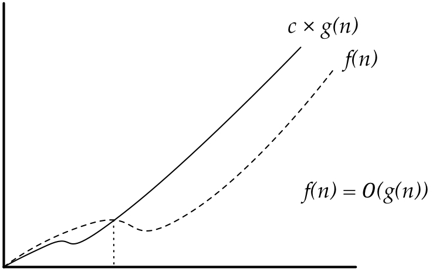

# Complexidade computacional

## O que é?

É como medir o desempenho, ou complexidade de um programa.

Há duas maneiras de medir este desempenho :

1. Tempo
2. Memória

## Complexidade de Tempo

Em geral, costuma-se medir o tempo, todavia, o tempo em si é uma medida consistente, porque é dependente da maquina.

Uma medida que generaliza o tempo, é a quantidade de operações de um programa.

O interessa no estudo da complexidade de tempo é a quatidade de operações de **algoritmos**.

## Exemplo de agoritmos :

- Busca : Dado um vetor V e um elemento x, procurar por x em v ou decidir que x não contém em v.

- Código :

        int busca(int *v, int n, int x){
            int i;
            for(i=0,i<n;i++){
                if(v[i]==x){
                    return i;
                }
            }

            return -1;
        }

Neste exemplo, observamos que a complexidade do algortimo, depende do tamanho de **n**. Ou seja, a quantidade de operações geralmente depende do tamanho da entrada.

Pode acontecer do algoritmo se comportar deferentemente para diferentes entradas.

## Tipos de caso

- Melhor caso
- Pior caso
- Caso médio

Geralmente estamos interessados no pior caso. Em nosso Exemplo do algoritmo de busca, dizemos que o nosso algortimo consome 2n + 1 operações no pior caso.

## Complexidade na forma matemática

- Ex :

Seja f() uma função que calcule quantas operações nosso algortimo exeuta em função da entrada.

f Z+ -> Z+

### Definição 

Dizemos que uma função f(n) pertence a O(g(n)) se existem constantes c>0 e n0>=0 tais que : 

O <= f(n) <= c*g(n), para todo n>=n0.

- Ex : No algoritmo de busca f(n) = 2n + 1. Considere g(n) = n.

O <= 2n+1 <= 3n, para todo n>1.

**Obs: Prova feita por indução**

A notação big O, mede o comportamento assintótico da função, portanto é adequada para valores de n muito grandes,mas nem sempre para valores relativamente pequenos.

## Complexidades comuns

1. O(1) -> Constante (o mais rapido)
2. O(lg n) -> Logaritmico (Geralmente muito bom)
3. O(n) -> Linear (Bom)
4. O(n log n) -> Quasilinear (Bom)
5. O(n²) -> Quadrático (Aceitavel em alguns casos)
6. O(n^k), -> Polinomial (k>1, pode ser ruim para n grande).
7. O(k^n), O(n!), O(n^n) -> Exponencial (Não aceitaveis)

## Classes de complexidade

### P (Polynomial-time) :

Problemas que conhece um algortimo polinomial para sua resolução.

### NP (Nondeterministc-polynomial) :

Problemas para quais não se conhece um algoritmo polinomial para sua resolução, mas há um algoritmo "polinomial" para verificar se uma instância é solução de um problema.

## Bibliografia

- [Algoritmos - Teoria e prática, Thomas H.Cormem](http://www.inf.ufrgs.br/~tsrodrigues/utilidades/cormem.pdf)
