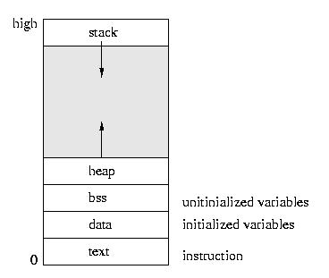

- A memória do computador é representado por um "vetor" emque cada bloco representa um byte(8 bits).

- A função sizeof() retorna a quantidade em bytes de uma variável ou um tipo de dado(float, int, short ....).

- O endereço de memória é gerado de maneira "randomica" pelo SO em tempo de execução.

- Uma variável declarada staticamente é marcada como livre ao final do escopo pelo sistema operacional, ou seja ela é "desalocada".

- O operador "&" retorna o endereço de memória de uma variável.

- O scanf() realiza uma passagem de valor por referência.

- O sistema operacional separa o espaço de memória de forma separada para cada tipo de variável de execução.

